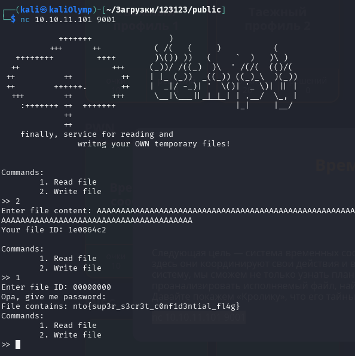

# Временные сообщения

Эксплуатируя уязвимое использование функции `strcmp`, которая сравнивает строки только до нуль-байта, записали 256 символов в содержимое файла, таким образом, первый байт пароля стал нуль-байтом (т.к. содержимое и пароль идут в памяти подряд, а длина содержимого только 256 байт). После этого можно прочитать флаг без пароля

**Флаг:** `nto{sup3r_s3cr3t_c0nf1d3ntial_fl4g}`