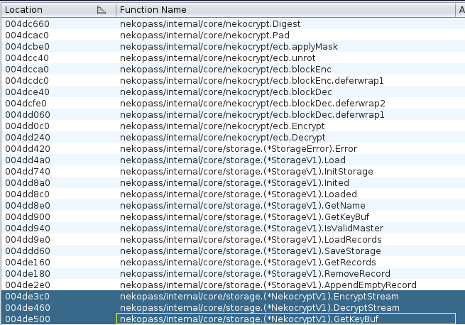
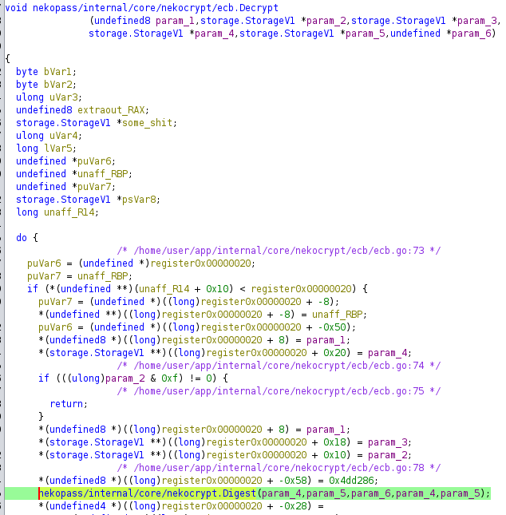
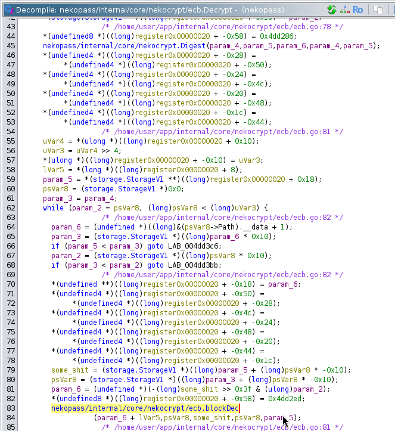
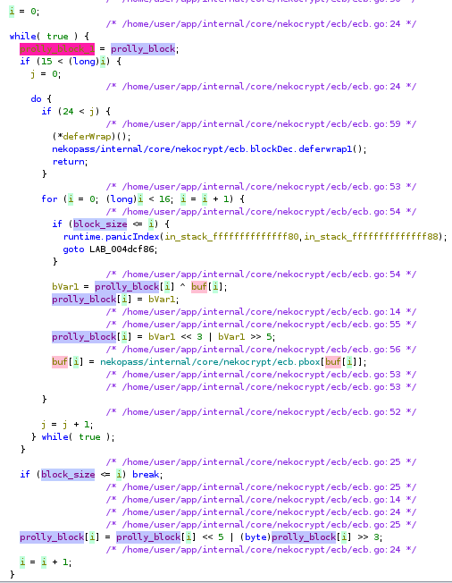
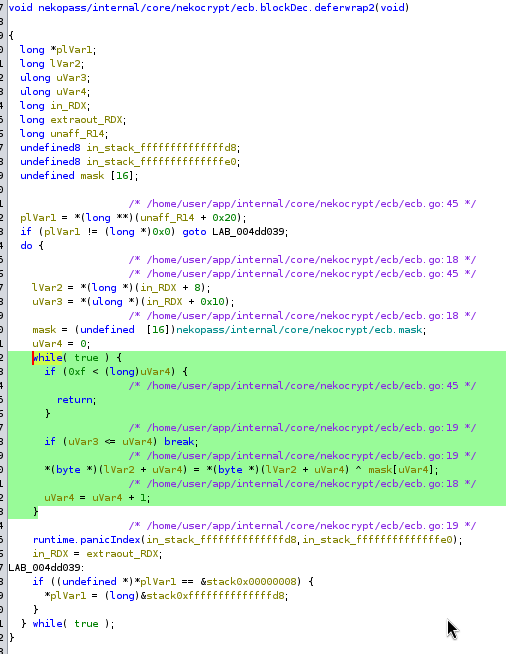
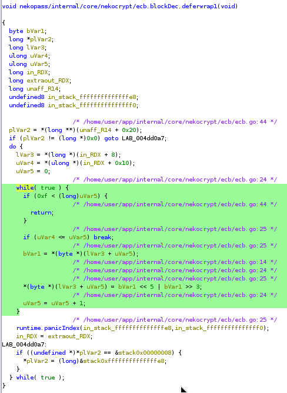
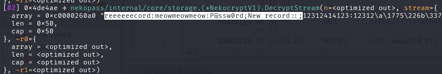

# Менеджер паролей 1

Открываем бинарь в ghidra с плагином [GolangAnalyzer](https://github.com/mooncat-greenpy/Ghidra_GolangAnalyzerExtension)

Замечаем несколько гошных функций, связанных с шифрованием:


Заходим в `ecb.Decrypt()`, там сначала вызывается `Digest()` от пароля (какой то хэш):


Далее для каждого блока вызывается `blockDec()`:


В ней выполняется непосредственно расшифровка блока:


После кода в `blockDec` выполняются deferы:



Так же заметим, что в функции `ecb.Encrypt`, перед шифрованием блока выполняется функция `Pad`, которая добивает какими-то символами (скорее всего соответствующими длине паддинга) данные до размера блока

Ещё, немного повтыкав в gdb, можно понять формат, в который сериализуются записи:


Формат такой: название записи, имя пользователя и пароль разделяются двоеточиями, а записи разделяются точками с запятой

---

После понимания примерного устройства шифра, переписали декриптор на питон:
```python
def decryptBlock(block, key, startOffset, bs):
    block = deepcopy(block)
    key = deepcopy(key)
    for i in range(startOffset, startOffset + bs):
        block[i] = lrot(block[i], 5)
    for r in range(25):
        for i in range(startOffset, startOffset + bs):
            block[i] = lrot(block[i] ^ key[i], 3)
            key[i] = PBOX[key[i]]
    for i in range(startOffset, startOffset + bs):
        block[i] ^= mask[i]
    for i in range(startOffset, startOffset + bs):
        block[i] = lrot(block[i], 5)
    return block
```

Происходит примерно следующее: сначала каждый байт шифртекста циклически сдивигается на 5 влево; далее, 25 раундов каждый байт блока ксорится с соответствующим байтом ключа, и потом на каждый байт ключа применяется pbox; в конце к получившемуся блоку ксорится маска, а потом каждый байт блока циклически сдвигается на 5 влево.

Тут задача из реверса превращается в крипту :)

Заметим, что ломать кастомный хэш, смотря на его (возможно криво) декомпилированную гидрой версию, будет слишком сложно.

Также заметим, что шифр не особо надежный, т.к. каждый байт открытого текста после расшифровки зависит только от соответствующего байта шифртекста, соответсвующего байта ключа и позиции в блоке (и то только за счёт маски), но не от всего остального шифртекста и ключа. Блоки никак не чейнятся, шифруются отдельно (отсюда и название ecb).

Используя эту информацию, можно предпосчитать все возможные комбинации позиции в блоке(16 вариантов), байта шифртекста(256 вариантов) и байта ключа(256 вариантов). 

Мы сделали это следующим кодом. В нём эта таблица предподсчёта хранится как мапа, где ключи - это тьюплы (позиция в блоке, байт шифртекста), а значения - массивы из 256 элементов, где на i-той позиции находится байт открытого текста для байта ключа, равного i.
```python
rainbow = {}
for offset in range(16):
    for ct in range(256):
        meow = []
        for k in range(256):
            c = [0] * offset + [ct] + [0] * (15 - offset)
            key = [0] * offset + [k] + [0] * (15 - offset)
            res = decryptBlock(c, key, 0, 16)
            meow.append(res[offset])
        rainbow[(offset, ct)] = meow
```

С использованием интерпретатора питона с JIT (pypy3), предподсчёт занимает всего 2.5 секунды (с обычным cpython - минуту)

Далее, достанем из `flag.nekopass` все три блока шифртекста (предварительно раскурив оффсеты через gdb)
```python
ctFlag = [0x27,0x0a,0x46,0x55,0x5c,0x80,0xba,0x99,0x80,0xe4,0x9e,0x51,0x74,0x14,0x04,0xfb]
ctFlag1 = [0x4e,0x13,0x37,0x95,0x04,0x33,0x59,0x69,0x21,0xac,0xf6,0x59,0x9c,0x84,0xd4,0xa9]
ctFlag2 = [0xef,0xe9,0xa7,0x07,0xe5,0xda,0xb0,0xfb,0xd2,0x5d,0x85,0x9a,0x67,0xa7,0x1f,0x0a]
ctFull = ctFlag + ctFlag1 + ctFlag2
```

Далее, определим оффсеты, на которых может находиться подстрока `:nto{` (двоеточие из формата хранения данных) и сгенерируем все ключи, которые возможны.
```python
offsets = []
for offset in range(len(ctFull) - 5):
    block = ctFull[offset:offset+5]
    flag = True
    for block_index,(c, p) in enumerate(zip(block, b':nto{')):
        if p not in rainbow[( 
            (offset + block_index) % 16,
            c
        )]:
            flag = False
            break
    if flag:
        print("Posssibly at offset", offset)
        offsets.append(offset)

keys = [[[], [], [], [], []] for i in range(6)] # found 6 possible offsets

for off_index, off in enumerate(offsets):
    block = ctFull[off:off + 5]
    for i,(p, c) in enumerate(zip(b':nto{', block)):
        vals = rainbow[(
            (off + i) % 16,
            c
        )]
        for j,v in enumerate(vals):
            if v == p:
                keys[off_index][i].append(j)

print("Generated key sets:")
print(*keys, sep='\n')
```

Далее, собираем возможные ключи, учитывая, что найденные кусочки ключа могут находиться на границе блока
```python
normalized_keys = []
for off_index,off in e(offsets):
    print("Trying offset", off)
    keyset = keys[off_index]
    for key in itertools.product(*keyset):
        kk = [0] * len(ctFull)
        for i in range(off, off + 5):
            kk[i] = key[i - off]
        key = list(map(
            lambda i: kk[i] + kk[16 + i] + kk[32 + i],
            range(16)
        ))
        normalized_keys.append((key, off_index))
        print(key)
```

Далее, пытаемся расшифровать весь шифртекст полученными ключами:
```python
for key in normalized_keys:
    plaintext = decryptBlock(ctFlag, key[0], 0, 16) + decryptBlock(ctFlag1, key[0], 0, 16) + decryptBlock(ctFlag2, key[0], 0, 16)
    res = b''
    for i,v in e(plaintext):
        if key[0][i % 16] == 0:
            res += b'.'
        else:
            res += bytes([v])
    print(res, key[0])
```

Вот все полученные открытые тексты
```
b'..:nto{...........\x14v\x7f\x19\x07...........\x06$C$:.........' [0, 0, 13, 211, 27, 194, 115, 0, 0, 0, 0, 0, 0, 0, 0, 0]
b'..:nto{...........\x14v\x7f\x19\x07...........\x06$C$:.........' [0, 0, 13, 211, 27, 194, 234, 0, 0, 0, 0, 0, 0, 0, 0, 0]
b'..:nto{...........\x14v\x7f\x19\x07...........\x06$C$:.........' [0, 0, 13, 211, 185, 194, 115, 0, 0, 0, 0, 0, 0, 0, 0, 0]
b'..:nto{...........\x14v\x7f\x19\x07...........\x06$C$:.........' [0, 0, 13, 211, 185, 194, 234, 0, 0, 0, 0, 0, 0, 0, 0, 0]
b'.........:nto{...........3curi...........\r\r\r\r\r..' [0, 0, 0, 0, 0, 0, 0, 0, 0, 89, 47, 94, 127, 27, 0, 0]
b'.........:nto{...........3curi...........\r\r\r\r\r..' [0, 0, 0, 0, 0, 0, 0, 0, 0, 89, 47, 94, 127, 185, 0, 0]
b'.........:nto{...........3curi...........\r\r\r\r\r..' [0, 0, 0, 0, 0, 0, 0, 0, 0, 89, 209, 94, 127, 27, 0, 0]
b'.........:nto{...........3curi...........\r\r\r\r\r..' [0, 0, 0, 0, 0, 0, 0, 0, 0, 89, 209, 94, 127, 185, 0, 0]
b'.........:nto{...........3curi...........\r\r\r\r\r..' [0, 0, 0, 0, 0, 0, 0, 0, 0, 129, 47, 94, 127, 27, 0, 0]
b'.........:nto{...........3curi...........\r\r\r\r\r..' [0, 0, 0, 0, 0, 0, 0, 0, 0, 129, 47, 94, 127, 185, 0, 0]
b'.........:nto{...........3curi...........\r\r\r\r\r..' [0, 0, 0, 0, 0, 0, 0, 0, 0, 129, 209, 94, 127, 27, 0, 0]
b'.........:nto{...........3curi...........\r\r\r\r\r..' [0, 0, 0, 0, 0, 0, 0, 0, 0, 129, 209, 94, 127, 185, 0, 0]
b'.........:nto{...........3curi...........\r\r\r\r\r..' [0, 0, 0, 0, 0, 0, 0, 0, 0, 180, 47, 94, 127, 27, 0, 0]
b'.........:nto{...........3curi...........\r\r\r\r\r..' [0, 0, 0, 0, 0, 0, 0, 0, 0, 180, 47, 94, 127, 185, 0, 0]
b'.........:nto{...........3curi...........\r\r\r\r\r..' [0, 0, 0, 0, 0, 0, 0, 0, 0, 180, 209, 94, 127, 27, 0, 0]
b'.........:nto{...........3curi...........\r\r\r\r\r..' [0, 0, 0, 0, 0, 0, 0, 0, 0, 180, 209, 94, 127, 185, 0, 0]
b'..........:nto{...........7oi}a...........Y\x17\x16\x19\x18.' [0, 0, 0, 0, 0, 0, 0, 0, 0, 0, 49, 236, 83, 230, 75, 0]
b'..........:nto{...........7oi}a...........Y\x17\x16\x19\x18.' [0, 0, 0, 0, 0, 0, 0, 0, 0, 0, 49, 236, 83, 230, 217, 0]
b'..........:nto{...........7oi}a...........Y\x17\x16\x19\x18.' [0, 0, 0, 0, 0, 0, 0, 0, 0, 0, 49, 236, 253, 230, 75, 0]
b'..........:nto{...........7oi}a...........Y\x17\x16\x19\x18.' [0, 0, 0, 0, 0, 0, 0, 0, 0, 0, 49, 236, 253, 230, 217, 0]
b'CWAc...........:nto{...........pZ+})...........\x04' [2, 19, 190, 17, 0, 0, 0, 0, 0, 0, 0, 0, 0, 0, 0, 98]
b'CWAc...........:nto{...........pZ+})...........\x04' [2, 19, 190, 108, 0, 0, 0, 0, 0, 0, 0, 0, 0, 0, 0, 98]
b'CWAc...........:nto{...........pZ+})...........\x04' [2, 19, 190, 235, 0, 0, 0, 0, 0, 0, 0, 0, 0, 0, 0, 98]
b'.........3curi...........:nto{...........\x04\x00\x0c\x10\x1f..' [0, 0, 0, 0, 0, 0, 0, 0, 0, 173, 109, 73, 221, 80, 0, 0]
b'.........3curi...........:nto{...........\x04\x00\x0c\x10\x1f..' [0, 0, 0, 0, 0, 0, 0, 0, 0, 173, 109, 73, 221, 122, 0, 0]
b'.........3curi...........:nto{...........\x04\x00\x0c\x10\x1f..' [0, 0, 0, 0, 0, 0, 0, 0, 0, 173, 109, 73, 221, 246, 0, 0]
b'#\x12H%L...........\x0e1f=G...........:nto{...........' [221, 1, 161, 72, 178, 0, 0, 0, 0, 0, 0, 0, 0, 0, 0, 0]
b'#\x12H%L...........\x0e1f=G...........:nto{...........' [221, 32, 161, 72, 178, 0, 0, 0, 0, 0, 0, 0, 0, 0, 0, 0]
b'#\x12H%L...........\x0e1f=G...........:nto{...........' [221, 38, 161, 72, 178, 0, 0, 0, 0, 0, 0, 0, 0, 0, 0, 0]
```

Заметим, что с оффсетом 9 получаются очень интересные вещи: в 2 блоке появляется строчка `3curi` (похоже на `security`), а в конце есть повторяющиеся `\r` - очень похоже на паддинг. Так же забавно, что у шифра есть особенность в том, что один и тот же шифр текст расшифровывается разными ключами

Возьмем все наденные ключи на оффсете 9 и попытаемся перебрать два байта ключа так, чтобы последние два символа были равны `\r\r` (т.к. паддинг)
```python
SELECTED_KEYSET = list(map(lambda x: x[0], filter(lambda x: x[1] == 1, normalized_keys)))
print('guessing')

SELECTED_KEYSET2 = []

for k1, k2 in itertools.product(range(256), repeat=2):
    for key in SELECTED_KEYSET:
        key = deepcopy(key)
        key[-1], key[-2] = k1, k2
        plaintext = decryptBlock(ctFlag, deepcopy(key), 0, 16) + decryptBlock(ctFlag1, deepcopy(key), 0, 16) + decryptBlock(ctFlag2, deepcopy(key), 0, 16)
        if plaintext[-1] != ord('\r') or plaintext[-2] != ord('\r'):
            continue
        SELECTED_KEYSET2.append(key)
        res = b''
        for i,v in e(plaintext):
            if key[i % 16] == 0:
                res += b'.'
            else:
                res += bytes([v])
        print(res, key)
```

Получаем несколько десятков возможных ключей, которые дают вот такой текст
```
b'.........:nto{n3.........3curity.........\r\r\r\r\r\r\r' [0, 0, 0, 0, 0, 0, 0, 0, 0, 129, 47, 94, 127, 27, 216, 130]
b'.........:nto{n3.........3curity.........\r\r\r\r\r\r\r' [0, 0, 0, 0, 0, 0, 0, 0, 0, 129, 47, 94, 127, 185, 216, 130]
b'.........:nto{n3.........3curity.........\r\r\r\r\r\r\r' [0, 0, 0, 0, 0, 0, 0, 0, 0, 129, 209, 94, 127, 27, 216, 130]
b'.........:nto{n3.........3curity.........\r\r\r\r\r\r\r' [0, 0, 0, 0, 0, 0, 0, 0, 0, 129, 209, 94, 127, 185, 216, 130]
b'.........:nto{n3.........3curity.........\r\r\r\r\r\r\r' [0, 0, 0, 0, 0, 0, 0, 0, 0, 180, 47, 94, 127, 27, 216, 130]
b'.........:nto{n3.........3curity.........\r\r\r\r\r\r\r' [0, 0, 0, 0, 0, 0, 0, 0, 0, 180, 47, 94, 127, 185, 216, 130]
b'.........:nto{n3.........3curity.........\r\r\r\r\r\r\r' [0, 0, 0, 0, 0, 0, 0, 0, 0, 180, 209, 94, 127, 27, 216, 130]
b'.........:nto{n3.........3curity.........\r\r\r\r\r\r\r' [0, 0, 0, 0, 0, 0, 0, 0, 0, 180, 209, 94, 127, 185, 216, 130]
```

Далее поняли, что имеет брутить дальше по паре символов, используя только один из найденных таким способом ключей

Брутим ещё пару символов ключа, используя тот факт, что байтов паддинга должно быть 13 (код символа `\r` = 13)
```python
SELECTED_KEYSET = [SELECTED_KEYSET2[0]]
SELECTED_KEYSET2 = []

print('guessing x2')

for k1, k2 in itertools.product(range(256), repeat=2):
    for key in SELECTED_KEYSET:
        key = deepcopy(key)
        key[-8], key[-9] = k1, k2
        plaintext = decryptBlock(ctFlag, deepcopy(key), 0, 16) + decryptBlock(ctFlag1, deepcopy(key), 0, 16) + decryptBlock(ctFlag2, deepcopy(key), 0, 16)
        if plaintext[-8] != ord('\r') or plaintext[-9] != ord('\r'):
            continue
        SELECTED_KEYSET2.append(key)
        res = b''
        for i,v in e(plaintext):
            if key[i % 16] == 0:
                res += b'.'
            else:
                res += bytes([v])
        print(res, key)
```

Получаем такие вот тексты
```
guessing x2
b'.......AG:nto{n3......._s3curity.......\r\r\r\r\r\r\r\r\r' [0, 0, 0, 0, 0, 0, 0, 184, 53, 89, 47, 94, 127, 27, 31, 24]
b'.......AG:nto{n3......._s3curity.......\r\r\r\r\r\r\r\r\r' [0, 0, 0, 0, 0, 0, 0, 200, 53, 89, 47, 94, 127, 27, 31, 24]
b'.......AG:nto{n3......._s3curity.......\r\r\r\r\r\r\r\r\r' [0, 0, 0, 0, 0, 0, 0, 184, 95, 89, 47, 94, 127, 27, 31, 24]
b'.......AG:nto{n3......._s3curity.......\r\r\r\r\r\r\r\r\r' [0, 0, 0, 0, 0, 0, 0, 200, 95, 89, 47, 94, 127, 27, 31, 24]
```

Повторяем процедуру ещё несколько раз, используя длину паддинга и получающиеся в начале строки `FLAG:FLAG`. Спустя несколько копирований блока кода получаем хакерский скрипт [sosal.py](sosal.py), который находит правильный флаг ценой 200 строчек не самого хорошего кода и 20 секунд в pypy3:
```
guessing x6
b'FLAG:FLAG:nto{n3koo_100_s3curity_0}\r\r\r\r\r\r\r\r\r\r\r\r\r' [134, 79, 190, 103, 208, 161, 196, 184, 53, 89, 47, 94, 127, 27, 31, 24]
```

**Флаг:** `nto{n3koo_100_s3curity_0}`